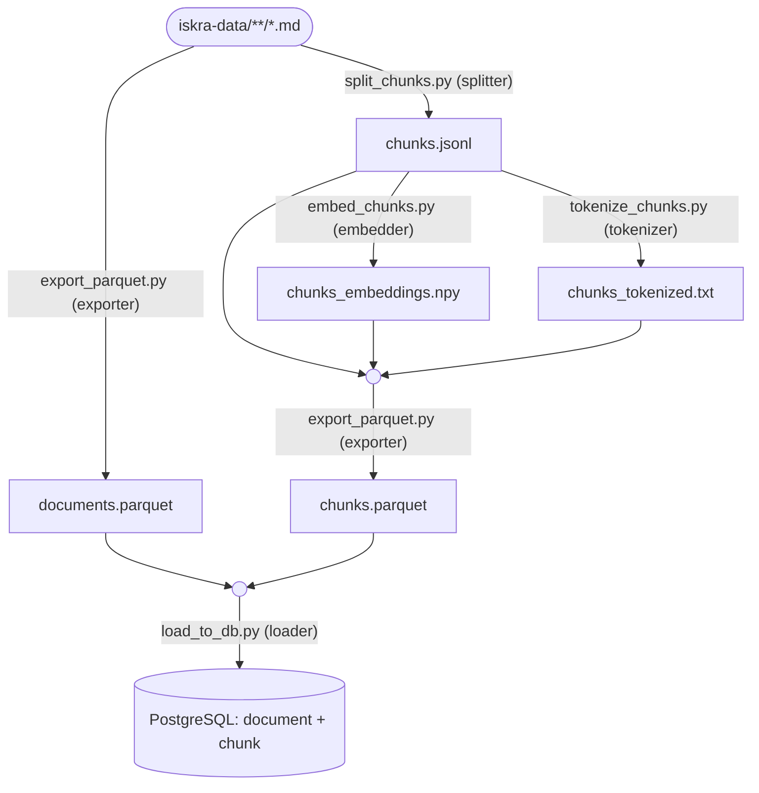

# iskra-etl

[](https://python.org)
[](LICENSE)


---

`iskra-etl` 是 `Iskra` 项目的 ETL 部分（离线切块 + 向量化 + 分词等），采用 [iskra-data](https://github.com/Qhbee/iskra-data) 的数据 。

最上游的语料一般由 [iskra-x2md](https://github.com/Qhbee/iskra-x2md) 从 EPUB/PDF 生成；
下游由 [iskra-engine](https://github.com/Qhbee/iskra-engine) 做向量检索与 RAG。

## `src/iskra_etl` 五个模块

| 模块 | 职责 |
|------|------|
| **`splitter`** | 扫描语料根下 `**/index.md`，去 frontmatter，LlamaIndex 按标题骨架 + token 切段，过短块合并；输出切块记录。 |
| **`embedder`** | 读切块 JSONL，用 Sentence-Transformers（默认 Jina 1024 维）批量编码，L2 归一化；编码前拼 `Document: ` 前缀。 |
| **`tokenizer`** | 读切块 JSONL，jieba 分词 + 停用词过滤，写出与 JSONL 行对齐的 `chunks_tokenized.txt`。                                       |
| **`exporter`** | 从语料生成 `documents.parquet`；把 JSONL 与行对齐的 `.npy` + `.txt`  拼成 `chunks.parquet`（含 `document_id`、文本、向量、分词）。 |
| **`loader`** | 笔记本经 SSH 隧道连远程 PG，对 `document` / `chunk` 两表做 `COPY`；非空库全量重载需 `--truncate`。 |

## `tests` 五个测试

`test_splitter` / `test_embedder` / `test_tokenizer` / `test_exporter` / `test_loader` 与 `src/iskra_etl` 里五个模块的一一对应

## 流程与产物

按顺序跑 `scripts/` 下五个 CLI（路径可用 `.env` 覆盖，见 [.env.example](.env.example)）：



**注意**：`chunks.jsonl` 与 `chunks_embeddings.npy` 与 `chunks_tokenized.txt` 必须同一次切块、同一次处理，行数一致；改切块后需重跑 embed、tokenize 及之后各步。

## 快速开始

```bash
cp .env.example .env   # 填语料根、SSH、PG 等
uv sync

uv run python scripts/split_chunks.py
uv run python scripts/embed_chunks.py
uv run python scripts/tokenize_chunks.py
uv run python scripts/export_parquet.py
uv run python scripts/load_to_db.py --truncate   # 非空库全量重载时
```

其它脚本：`stats_chunk_lengths.py`（块长统计）、`smoke_st_embed.py` / `compare_st_gguf_cos.py`（嵌入冒烟与 ST/GGUF 对比）、`backfill_chunk_text_search_vector.py`（仅回填 `tokenized_fts`，可重复执行），非主链路。
